# Built and Deployed the Environment

---

### 1. Infrastructure and Environment
- I set up a Kubernetes environment using **`Minikube`**, which serves as an ideal platform for local development.
- It provides a flexible space for application testing, troubleshooting, and experimentation.

---

### 2. User Interface Service
- The user interface for login and registration using **`HTML`** and **`JavaScript`**.
- This interface integrates with the API to handle image uploads, register new users, validate login credentials, and display profiles of users.

---

### 3. API Service
- The Application Programming Interface (**`API`**) is built using **`Python`** to handle data coming from users.
- The backend logic processes this data and communicates with other services, applying the **`Gateway Pattern`** to manage requests and responses efficiently.

---

### 4. Authentication Service
- The Authentication service is an internal component that verifies user credentials, such as usernames and passwords.
- It does not handle direct external requests; instead, it receives data from the main API service.
- Built with **`Python`**, it processes and validates login information to ensure secure access.

---

### 5. Image Service
- Serves as a centralized storage zone for user images, providing access and retrieval capabilities.
- Built with **`Go`** to ensure performance and scalability.

---

### 6. Docker Containerization
- **`Docker`** is a containerization technology that allows to package applications and their dependencies into isolated units called containers.
- I used Docker to build container images, which are then deployed, orchestrated, and managed by **`Kubernetes`**.

#### My Docker Images
- `api-service`
- `auth-service`
- `image-servic`
- `webportal-service`
- **`Registry images`**: used to store the Docker images that are built internally.

---

### Kubernetes Orchestration

Kubernetes is a container orchestration platform designed to manage and scale large numbers of containers across a cluster of machines.  

**Implementation Steps:**

1. **Deployed Containers as Deployments**
   - Managed **Pods** and enabled scaling up or down as needed.

2. **Configured Horizontal Pod Autoscaler (HPA)**
   - Enabled dynamic autoscaling to automatically add new Pods when resources are highly utilized.

3. **Set Up Kubernetes Services**
   - Configured **ClusterIP** services for internal communication between Pods.

4. **Applied NetworkPolicies**
   - Restricted network traffic to only authorized Pods, enhancing security and reducing unnecessary connections.

5. **Configured Health Probes**
   - Implemented **livenessProbes** to restart unhealthy Pods.
   - Implemented **readinessProbes** to ensure Pods receive traffic only when ready.

6. **Created Pod Disruption Budget (PDB)**
   - Ensured a minimum number of Pods remain available during maintenance or node upgrades.

7. **Managed Sensitive Data with Secrets**
   - Stored passwords and other sensitive data in **Kubernetes Secrets**, securely passed to Pods.

8. **Managed Non-Sensitive Configuration**
   - Used **ConfigMaps** to store environment variables or application settings.

9. **Provisioned Persistent Storage**
   - Configured **Persistent Volumes (PV)** and **Persistent Volume Claims (PVC)** for applications and databases.

---

### Ingress Controller
- Routes **HTTP/HTTPS** traffic to services.
- Configured routing to service endpoints and secured it using self-signed **TLS certificates**.

---

### Issuer with cert-manager
- **Issuer** → Kubernetes object used to release certificates.  
- **cert-manager** → Kubernetes controller managing TLS certificates, including self-signed ones, automatically.  
- Configured the **Issuer** and referenced it in the **Certificate** object to create the **TLS secret**.

---

### OpenSSL with Secret TLS
- **OpenSSL** → Tool to generate TLS self-signed certificates locally.
- Steps:
  1. Generated **Private Key**.
  2. Created a **Certificate Signing Request (CSR)** and generated the certificate.
  3. Allocated the certificate with the key to Kubernetes **secret tls**.

> [!NOTE]
> There are three ways to generate certificates in Kubernetes:
1. **Manual** 🛠️  
   - Use **OpenSSL** to generate certificates and manually create the TLS secret.

2. **With Issuer and cert-manager** 📜  
   - Create Kubernetes objects (**Issuer** and **Certificate**) managed automatically by **cert-manager**.  
   - *(Implementation method used in this project)*

3. **Automated via Ingress Annotations** 🚀  
   - Create an **Issuer** and reference it in the Ingress annotations (`cert-manager.io/issuer`).  
   - cert-manager automatically generates and manages the certificate.

---

### Helm Charts for Kubernetes
- **Helm** → Package manager for Kubernetes, allowing definition, installation, and management of applications using preconfigured charts.
- Installed Helm charts.
- Used Helm to deploy the **prometheus-community** chart, which bundles:
  - `Prometheus`
  - `AlertManager`
  - `Grafana`

---

### Prometheus, AlertManager, and Grafana
- **Prometheus** → Monitoring tool that scrapes metrics and stores them in a time-series database (**TSDB**).  
  - Configured Prometheus to scrape metrics from services and persist the data.  
  - Templates defined which services Prometheus should scrape.

- **AlertManager** → Groups, routes, and silences alerts from Prometheus before sending them to endpoints like email or Slack.  
  - Configured alerting rules and routing/receivers.

- **Grafana** → Data visualization tool for creating dashboards to monitor service metrics.  
  - Configured Prometheus as a data source.  
  - Created dashboards for key metrics:
    - `Status Pods`
    - `Histogram Bucket`
    - `HTTP Request Count`
    - `CPU Usage`
    - `Memory Usage`

> [!NOTE]
> Some services require an **external exporter** alongside the Pod to collect metrics.  
> These exporters must be included in **Prometheus scrape configurations** to ensure proper monitoring.

----
## Steps of failure simulation and recovery verification.

### Database Failure with API Service:
[View Database Failure with API Service Video](https://bit.ly/3UlgOTS)

* **Pre-Failure State Monitoring:**
    * I began by using the **'watch'** command-line tool with **'kubectl describe'** to monitor the Postgres database Deployment in the app-services namespace using:
        ```bash
        watch -n1 kubectl describe deployment <name-of-deployment> -n <namespace>
        ```
    * Concurrently, I observed the Pods with **'kubectl get'** Postgres and API services status.
        ```bash
        kubectl get pod -n <namespace> -l <label-of-pod-inside-yaml> -w
        ```
        * `-w --> is watch for changes.`
    * Then, I used **'kubectl logs -f'** to print the logs for a container in a pod resource streamly.
        ```bash
        kubectl logs -f <name-of-pod> -n <namespace>
        ```
    * Grafana dashboards and AlertManager showed a normal operational state (the database dashboard was **"Up"** and no active alerts existed). A new user was successfully registered via the frontend (webportal.local), confirming that all services were functioning correctly.

* **Simulating the Failure:**
    * To simulate a database failure, I scaled down the Postgres Deployment to zero replicas using **'kubectl scale deployment'**.
        ```bash
        kubectl scale deployment <name-of-deployment> --replicas=<number-scale> -n <namespace>
        ```
    * This action terminated the database Pod, causing the API service to lose its connection to the database.

* **Verifying Recovery:**
    * **Failure Detection:**
        * AlertManager detected the failure, initially showing a **Pending**.
        * Alert **Pending**:
            1.  `PostgresExporterHighScrapeLatency`
            2.  `APIServiceDown`
    * **Frontend failed:**
        * Attempts to log in through the frontend failed with a **"Failed to communicate with Auth service"** error.
        * The Grafana dashboard for the API service also showed a **"Down"** status.
    * **Service Restoration:**
        * Restored the service by scaling the database replicas back to one using **'kubectl scale deployment'**.
            ```bash
            kubectl scale deployment <name-of-deployment> --replicas=<number-scale> -n <namespace>
            ```

---

### Simulating a high utilization in Requests to the Image Service.

[View Simulating a high utilization in Requests to the Image Service Video](https://bit.ly/4fuLQlW)
* **Pre-Failure State Monitoring:**
    * started by monitoring the image-service Deployment in the app-services namespace using:
        ```bash
        watch -n1 kubectl describe deployment <name-of-deployment> -n <namespace>
        ```
    * Concurrently, I observed the HPA with **'kubectl get hpa'** Image-service utilize pod.
        ```bash
        kubectl get hpa <name-of-pod> -n <namespace>
        ```
    * The service initially had 2 replicas. The Grafana dashboards showed low CPU and memory usage for the service.

* **Simulating the Failure:**
    * I used the **'hey'** tool to generate and send a large number of requests:
        ```bash
        hey -n 100000 -c 100 [https://images.local/uploads/](https://images.local/uploads/)<image-name>.png
        ```
    * Due to the high utilization in CPU usage exceeding the threshold defined in the Horizontal Pod Autoscaler (HPA), Kubernetes automatically scaled up the replicas for the image-service.
    * The deployment's replica count increased from 2 to 10, then to 18, before stabilizing at 10 Pods.
    * The Grafana dashboard clearly showed a sharp increase in CPU usage, Memory usage,http requests, followed by a decrease as the new Pods were added.

* **Verifying Recovery:**
    * **Service Restoration:**
        * After the load test ended, Kubernetes automatically scaled down the Pods gradually based on the HPA settings.
        * Returning the replica count to the original number (2 Pods).
        * The Grafana dashboard returned to its normal state, indicating that the service had recovered and stabilized.
----
## Setup Environment

### Prerequisites:

| Tools | Description |
| --- | --- |
| `Docker` | Manage applications using containers. |
| `Minikube` | To use a Kubernetes cluster (for a local development environment) or a cloud provider. |
| `kubectl` | Is the command-line tool for interacting with Kubernetes clusters.|
| `Helm` | A package manager for Kubernetes.|
| `Load Testing Tool`| using `hey`. |

### Steps:
#### Docker Installation and Configuration
1.  **Install Docker:** Run the following command to install Docker on the local machine:
    ```bash
    curl -fsSL [https://get.docker.com](https://get.docker.com) -o get-docker.sh
    sudo sh get-docker.sh
    ```
2.  **Configure Docker daemon for local Registry:**
    * I'm planning to use a local Docker registry on the machine:
        * Edit the Docker `daemon.json` file, which exists on path `/etc/docker/deamon.json`.
        * If the file does not exist, create one.
        * Add the following configuration and replace with the local IP.
            ```json
            {
                 "insecure-registries": ["the-registry-host-(IP):5000"]
            }
            ```
        * Restart the Docker Engine:
            ```bash
            sudo systemctl restart docker
            ```


> [!IMPORTANT]
> If I use Docker Desktop, I can configure the code JSON format on it.
> 1. Go to the settings icon in the right corner, click, then will pop up page.
> 2. Then navigate to the 'Docker Engine' will see there is an empty box. Enter the command in the box.
> 3. Click 'Apply & restart'.

   
3. **Run Docker Registry**
    * Docker image Registry it's a private registry to store the repository images.
    * Following the command to run the container registry:
        ```bash
        docker run -d -p 5000:5000 --restart always --name registry registry:2
        ```
        > **`--restart always`**: is the policy to reload the container even if there are issues with the registry container, or restart the machine.


4. **Build Docker Image and Push**
    * Once the Docker daemon is configured, I can build and push to the local registry.
    * **API_service:**
        ```bash
        cd API_Service/
        # Docker Build api_service:
        docker build -f api-service -t the-registry-host(ip):5000/api-service:v1 .
        # Push image api_service:
        docker push the-registry-host(ip):5000/api-service:v1
        ```
    * **Auth_service:**
        ```bash
        cd Auth_service/
        # Docker Build auth-service:
        docker build -f auth-service -t the-registry-host(ip):5000/auth-service:v1 .
        # Push image auth-service:
        docker push the-registry-host(ip):5000/auth-service:v1
        ```
    * **Image_Service:**
        ```bash
        cd Image_Service/
        # Docker Build image-service:
        docker build -f image-service -t the-registry-host(ip):5000/image-service:v1 .
        # Push image-service:
        docker push the-registry-host(ip):5000/image-service:v1
        ```
    * **Frontend_service:**
        ```bash
        cd Frontend_service/
        # Docker Build Frontend-service:
        docker build -f frontend-service -t the-registry-host(ip):5000/webportal-service:v1 .
        # Push image webportal-service:
        docker push the-registry-host(ip):5000/webportal-service:v1
        ```
5. ####  Install and Configure Minikube
Once Docker is installed, I can install Minikube to run a local Kubernetes cluster on the machine.

1.  **Download and Install Minikube:**
    ```bash
    curl -LO [https://github.com/kubernetes/minikube/releases/latest/download/minikube-linux-amd64](https://github.com/kubernetes/minikube/releases/latest/download/minikube-linux-amd64)
    sudo install minikube-linux-amd64 /usr/local/bin/minikube && rm minikube-linux-amd64
    ```

2.  **Start Minikube Cluster:**
    This command starts the cluster and connects it to the local insecure registry.
    ```bash
    minikube start --cpus=2 --memory=4096 --cni=calico --ports=443:443 ports=80:80 --insecure-registry="the-registry-host(ip):5000"
    ```

**Command Options Explained:**

| Flag | Description |
| :--- | :--- |
| **`--cpus=2`** | Specifies the number of CPU cores to allocate from the host machine. It's recommended to set this to avoid consuming all resources. |
| **`--memory=4096`** | Specifies the amount of memory (in MB) to allocate from the host machine. |
| **`--cni=calico`** |  Must specify a Container Network Interface (CNI) that supports Network Policies, such as Calico. |
| **`--insecure-registry`**| Tells Minikube to trust the local Docker registry, allowing it to pull images from it. |
| **`--ports=`** | Export port |


## Deploying Objects to the Kubernetes Cluster

6.  **Runs Deployment on Kubernetes cluster**
    -   Run 'namespace' to allocate each objects for the namespace
        ```bash
        kubectl create namespace apps-services
        kubectl create namespace frontend-service
        ```
    -   Run following, To define the registry in Kubernetes, it's recommended to use a Secret for securely storing credentials, instead of including them directly in the configuration files. This approach enhances security and makes the configurations more manageable.
        ```bash
        kubectl create secret docker-registry my-registry-creds --docker-server=the-registry-host(ip):5000 --docker-username=<username> --docker-password=<Password>  --docker-email=<email>  -n app-services
        kubectl create secret docker-registry my-registry-creds --docker-server=the-registry-host(ip):5000 --docker-username=<username> --docker-password=<Password>  --docker-email=<email>  -n frontend-service
        ```
    * I divided the files to easy apply the deployments
        * **Issuer Certification:**
            -   I put the 'self-signed-issuer.yml' in the global file because most apps are following the namespace apps-services
                ```bash
                kubectl -f Apps_deployment/selfsigned-issuer.yml
                ```
        * **Postgresql-Group:**
            -   Create empty file to store data of database.
                ```bash
                mkdir -p Apps_deployment/mountDatabase
                ```
            -   I sterted with 'Databse' most apps is depends on the Database postgres , ConfigMap , Secret.
                ```bash
                kubectl -f Apps_deployment/Postgresql-Group/
                ```
        * **Api_Group:**
            ```bash
            kubectl apply -f Apps_deployment/Api-Group/
            ```
        * **Authentication-Group:**
            ```bash
            kubectl apply -f Apps_deployment/Authentication-Group/
            ```
        * **Image-Group:**
            ```bash
            kubectl apply -f Apps_deployment/Image-Group/
            ```
        * **WebPortal-Group:**
            ```bash
            kubectl -f Apps_deployment/WebPortal-Group/
            ```
            -   I already put Issuer with the Group of WebPortal because I have one app under the namespace 'frontend-service'
    -   **Network-Policy:**

> [!TIP]
> Before to start apply Networkpolicy there are two concepts 'ingress' , 'egress'
       

   | Type | Description |
   | :--- | :--- |
   | Ingress in network policy | (That meaning when reception your friend) and (which door will reception your friend)--> that mean(Ports)|
   | Egress in network policy  | (That meaning when goes your friend) and (which door will reception you) --> that mean(Ports) |

7.  **Run NetworkPolicy**
    -   I divided the file of grop policy and there are two yaml file it's outside the divided.
     
        * **Network-Policy Api:**
            ```bash
            kubectl -f Policy-Group/Policy-api-fromAndTo/
            ```
        * **Network-Policy Auth:**
            ```bash
            kubectl -f Policy-Group/Policy-auth-fromAndTo/
            ```
        * **Network-Policy Image:**
            ```bash
            kubectl -f Policy-Group/Policy-image-fromAndTo
            ```
        * **Network-Policy webportal:**
            ```bash
            kubectl -f Policy-Group/Policy-webportal-fromAndTo/
            ```
        * **Network-Policy Postgresql:**
            ```bash
            kubectl -f Policy-Group/Policy-postgresql-fromAndTo/
            ```
---
## Helm and Prometheus Installation

This guide covers the installation of Helm and the kube-prometheus-stack, which includes Prometheus, Alertmanager, and Grafana.

---
### 1. Install Helm
**Helm** is a package manager for Kubernetes that simplifies deploying and managing applications. It uses collections of pre-configured resources called "charts."

* **Download and install the Helm script:**
    ```bash
    curl -fsSL -o get_helm.sh [https://raw.githubusercontent.com/helm/helm/main/scripts/get-helm-3](https://raw.githubusercontent.com/helm/helm/main/scripts/get-helm-3)
    chmod 700 get_helm.sh
    ./get_helm.sh
    ```

---
### 2. Install Prometheus
We will use the `kube-prometheus-stack` chart from the prometheus-community repository.

1.  **Add the Prometheus community repository:**
    ```bash
    helm repo add prometheus-community [https://prometheus-community.github.io/helm-charts](https://prometheus-community.github.io/helm-charts)
    helm repo update
    ```

2.  **Install the chart:**
    This command installs the entire stack into a new `monitoring` namespace.
    ```bash
    helm install prometheus-stack prometheus-community/kube-prometheus-stack -n monitoring --create-namespace
    ```

---
### 3. Configure Prometheus Components
To monitor your custom applications, you need to configure `ServiceMonitor`, `PrometheusRule`, and `Alertmanager`.

1. **ServiceMonitor:**
   
To link Prometheus to your services, you must configure a `ServiceMonitor` resource. This tells Prometheus which services to scrape for metrics.
* **Apply the ServiceMonitor for your applications** (api, auth, image, webportal, postgres):
    ```bash
    kubectl apply -f Apps_deployment/prometheus-Configuration/apps-monitors.yml
    ```

2. **PrometheusRule:**
   
Apply `PrometheusRule` resources to define alerting rules. Prometheus uses these to generate alerts, which are then sent to Alertmanager.
* **Apply the custom alert rules for your applications:**
    ```bash
    kubectl apply -f Apps_deployment/prometheus-Configuration/app-alerts-rules.yml
    ```

3.  **Alertmanager:**
    
    Configure Alertmanager to route alerts to a notification service like Slack by following these steps:

    1.  **Create the `alertmanager.yml` file:**
        Create a file named `alertmanager.yml` with the following content, adding your specific Slack webhook URL.
        ```yaml
        slack_configs:
        - channel: '#Apps-Alerts'
          api_url: 'YOUR_SLACK_WEBHOOK_URL'
        ```

           
 > [!TIP]
> * You must have an account on *Slack*.*
> * Get the webhook URL from the **Incoming Webhooks** section in your Slack app settings.*
> * The `api_url` is the secret URL you receive from Slack.*


 1.  **Create the Secret from the configuration file:**
    
      ```bash
           kubectl create secret generic alertmanager-config --from-file=Apps_deployment/prometheus-Configuration/alertmanager.yml -n monitoring --dry-run=client -o yaml | kubectl apply -f -
      ```

3.  **Update the Helm release to use the new Secret:**

       ```bash
        helm upgrade prometheus-stack prometheus-community/kube-prometheus-stack \
         --namespace monitoring \
         --set alertmanager.config.configmapName=alertmanager-config \
         --set alertmanager.config.templateSecretName=alertmanager-config
       ```

5.  **Create an ingress for Alertmanager:**
        This allows you to access the Alertmanager UI over HTTPS instead of using `port-forward`.
    
   ```bash
        kubectl apply -f alertManager-ingress.yml
   ```
---
## 13. Grafana
Once you have set up and configured Prometheus and Alertmanager, you can configure Grafana.

* **Create an ingress for Grafana** to allow access over an HTTPS page instead of using `port-forward`.
    ```bash
    kubectl apply -f grafana-ingress.yaml
    ```
    You should then be able to access it at `https://grafana.local`.

* There are two ways to import visualization dashboards:
>[!TIP]
> **A. Manual Method**
> 1.  In the left sidebar, navigate to **Dashboards**.
> 2.  On the Dashboards page, click the **New** button.
> 3.  From the dropdown list, choose **Import**.
> 4.  Finally, import the JSON dashboard files.
> 5.  The dashboard files are located in the `Grafana_DashBoard` directory.

**B. Automated Method**

   You can automatically import dashboards by upgrading the `kube-prometheus-stack` chart with a custom `grafana-values.yml` file.

   1.  **Create a ConfigMap** from the directory containing all your dashboard files.
        ```bash
        kubectl create configmap my-grafana-dashboards --from-file=Grafana_DashBoard/ -n monitoring
        ```
   2.  **Add a label and annotation.** The Grafana sidecar looks for this label and annotation to provision the dashboards.
        ```bash
        kubectl label configmap my-grafana-dashboards grafana_dashboard="1" -n monitoring
        kubectl annotate configmap my-grafana-dashboards grafana_folder="Application Services" -n monitoring
        ```
   3.  **Upgrade the `kube-prometheus-stack`** to use the values file that enables the sidecar to detect these dashboards.
        ```bash
        helm upgrade prometheus-stack prometheus-community/kube-prometheus-stack -n monitoring -f grafana-values.yml
        ```
 **This method avoids the need to import each dashboard manually.**

 ---
 ## Final Steps: Automation and Troubleshooting

Here are the final steps for automating the deployment with a script and how to perform basic troubleshooting.

### Automated Setup Script
Before running the deployment script, it's recommended to follow these one-time steps to configure Docker permissions. This allows you to run Docker commands as your current user without needing `sudo` every time.

1.  **Create the `docker` group (if it doesn't already exist):**
    ```bash
    sudo groupadd docker
    ```

2.  **Add your user to the `docker` group:**
    ```bash
    sudo usermod -aG docker $USER
    ```

3.  **Apply the new group membership:**
    ```bash
    su - ${USER}
    ```
   > [!WARNING]
   > **Important:** You must **log out and log back in** for the new group membership to take full effect.

4.  **Run the Deployment Script:**
    Now you can run the infrastructure deployment script.
> [!NOTE]
> Do not run the script as `sudo`.
  ```bash
  ./deploy_Apps_K8s.sh
  ```

### Basic Troubleshooting
If you encounter any issues with your pods, these are the first commands you should run to diagnose the problem.

  * **What it does:** Lists all pods in the specified namespace and shows their current status (e.g., `Running`, `Pending`, `CrashLoopBackOff`). This is the quickest way to see the overall health.
    * `kubectl get pod -n <namespace>`

 * **What it does:** Provides detailed information about a specific pod, including recent events. This is extremely useful for figuring out *why* a pod isn't starting (e.g., image pull errors, resource issues).
    * `kubectl describe pod <name-of-pod> -n <namespace>`
 
 * **What it does:** Streams the live output (logs) from the application running inside the pod. This is essential for debugging application-level errors.
    * `kubectl logs <name-of-pod> -n <namespace>`
   


---
# Cloud-Native Microservices Project on Kubernetes

This project demonstrates the complete lifecycle of a resilient, observable, and scalable microservices application deployed on Kubernetes. It covers everything from containerization with Docker, deployment automation, advanced security configuration with Network Policies, to comprehensive monitoring with the Prometheus stack. The project also includes practical failure simulation scenarios to validate the system's reliability.

## 🏛️ Architecture Diagram

The following diagram illustrates the architecture of the system, showing how services communicate with each other and with external components.

```mermaid
graph TD
    subgraph "User Interaction"
        User[👤 User] --> Browser[🌐 Browser]
    end

    subgraph "External World"
        Browser --> Ingress[🚪 Ingress Controller]
    end

    subgraph "Kubernetes Cluster"
        Ingress -->|"webportal.local"| FrontendNS[frontend-service Namespace]
        Ingress -->|"api.local, images.local"| AppNS[app-services Namespace]

        subgraph "frontend-service Namespace"
            direction LR
            FrontendNS --> WebPortal(🖼️ Web Portal)
        end

        subgraph "app-services Namespace"
            direction TB
            WebPortal -->|HTTP Requests| APIService(⚙️ API Service)
            APIService --> AuthService(🔑 Auth Service)
            APIService --> ImageService(🖼️ Image Service)
            APIService --> DB[(🗄️ PostgreSQL)]
            AuthService --> DB
            ImageService --> S3[☁️ Amazon S3]
        end

        subgraph "Security"
            Secrets[🔒 K8s Secrets] -.->|DB Credentials| AuthService
            Secrets -.->|DB & JWT Secret| APIService
            Secrets -.->|S3 Credentials| ImageService
        end
    end
```



## ✨ Key Features
- **Microservices Architecture:** A system composed of independent services (API, Auth, Image) written in different languages (Python, Go).
- **Kubernetes Deployment:** Container orchestration using Deployments, Services, and Namespaces.
- **Auto-Scaling:** Horizontal Pod Autoscaler (HPA) to handle traffic spikes automatically.
- **Advanced Security:** Service isolation with Network Policies and secure credential management with Kubernetes Secrets.
- **Comprehensive Monitoring:** Full observability stack with Prometheus, Grafana, and AlertManager.
- **High Availability:** Ensured with Liveness/Readiness Probes and PodDisruptionBudgets.
- **Failure Simulation:** Practical scenarios to test and verify system resilience and recovery.

## 🛠️ Tech Stack

| Category | Technology | Description |
| :--- | :--- | :--- |
| **Orchestration** | Kubernetes (Minikube) | To manage, deploy, and scale containerized applications. |
| **Containerization** | Docker | To build and package applications into containers. |
| **Backend Services**| Python, Go | Languages used for building backend microservices. |
| **Frontend Service**| HTML, JavaScript | For the user-facing web portal. |
| **Monitoring** | Prometheus, Grafana | To collect metrics and visualize them in dashboards. |
| **Alerting** | AlertManager | To handle and route alerts from Prometheus. |
| **Package Manager** | Helm | To manage and deploy Kubernetes applications using charts. |

---
## 🚀 Getting Started

This section provides detailed instructions on how to set up the environment and deploy the entire project from scratch.

### Prerequisites

| Tool | Description |
| :--- | :--- |
| `Docker` | To manage applications using containers. |
| `Minikube` | To run a local Kubernetes cluster. |
| `kubectl` | The command-line tool for interacting with Kubernetes. |
| `Helm` | A package manager for Kubernetes. |
| `hey` | A load testing tool. |

### Installation and Deployment Steps

#### Step 1: Docker Installation and Configuration

1.  **Install Docker:**
    ```bash
    curl -fsSL [https://get.docker.com](https://get.docker.com) -o get-docker.sh
    sudo sh get-docker.sh
    ```

2.  **Configure Docker Daemon for a Local Registry:**
    To use a local Docker registry, edit the Docker `daemon.json` file (usually at `/etc/docker/daemon.json`). If it doesn't exist, create it. Add the following configuration, replacing `the-registry-host-(IP)` with your local machine's IP address.
    ```json
    {
      "insecure-registries": ["the-registry-host-(IP):5000"]
    }
    ```
    Then, restart the Docker Engine:
    ```bash
    sudo systemctl restart docker
    ```
    > [!IMPORTANT]
    > If you use Docker Desktop, you can configure this directly in `Settings > Docker Engine`.

3.  **Run the Local Docker Registry:**
    This command runs a private registry container to store your application images.
    ```bash
    docker run -d -p 5000:5000 --restart always --name registry registry:2
    ```
    > **`--restart always`**: This policy ensures the registry container restarts automatically if it fails or if the machine is rebooted.

4.  **Build and Push Docker Images:**
    Navigate to each service directory to build the image and push it to your local registry.
<details>
<summary><strong>Click here to view the build and push commands</strong></summary>

* **API Service:**
    ```bash
    cd API_Service/
    docker build -f api-service -t the-registry-host(ip):5000/api-service:v1 .
    docker push the-registry-host(ip):5000/api-service:v1
    ```
* **Auth Service:**
    ```bash
    cd Auth_service/
    docker build -f auth-service -t the-registry-host(ip):5000/auth-service:v1 .
    docker push the-registry-host(ip):5000/auth-service:v1
    ```
* **Image Service:**
    ```bash
    cd Image_Service/
    docker build -f image-service -t the-registry-host(ip):5000/image-service:v1 .
    docker push the-registry-host(ip):5000/image-service:v1
    ```
* **Frontend Service:**
    ```bash
    cd Frontend_service/
    docker build -f frontend-service -t the-registry-host(ip):5000/webportal-service:v1 .
    docker push the-registry-host(ip):5000/webportal-service:v1
    ```
</details>

#### Step 2: Minikube Installation and Setup

1.  **Download and Install Minikube:**
    ```bash
    curl -LO [https://storage.googleapis.com/minikube/releases/latest/minikube-linux-amd64](https://storage.googleapis.com/minikube/releases/latest/minikube-linux-amd64)
    sudo install minikube-linux-amd64 /usr/local/bin/minikube && rm minikube-linux-amd64
    ```

2.  **Start the Minikube Cluster:**
    This command starts the cluster and connects it to the local insecure registry.
    ```bash
    minikube start --cpus=2 --memory=4096 --cni=calico --ports=443:443 --ports=80:80 --insecure-registry="the-registry-host(ip):5000"
    ```

#### Step 3: Deploying Applications to the Kubernetes Cluster

1.  **Create Namespaces:**
    ```bash
    kubectl create namespace app-services
    kubectl create namespace frontend-service
    ```

2.  **Create a Docker Registry Secret:**
    This allows Kubernetes to pull images from your private registry.
    ```bash
    # For app-services namespace
    kubectl create secret docker-registry my-registry-creds --docker-server=the-registry-host(ip):5000 --docker-username=<username> --docker-password=<Password> --docker-email=<email> -n app-services

    # For frontend-service namespace
    kubectl create secret docker-registry my-registry-creds --docker-server=the-registry-host(ip):5000 --docker-username=<username> --docker-password=<Password> --docker-email=<email> -n frontend-service
    ```

3.  **Apply Deployment Manifests:**
    The manifest files have been grouped for easier deployment.
    * **Issuer Certification:**
        ```bash
        kubectl apply -f Apps_deployment/selfsigned-issuer.yml
        ```
    * **Postgresql Group:**
        ```bash
        mkdir -p Apps_deployment/mountDatabase
        kubectl apply -f Apps_deployment/Postgresql-Group/
        ```
    * **API Group:**
        ```bash
        kubectl apply -f Apps_deployment/Api-Group/
        ```
    * **Authentication Group:**
        ```bash
        kubectl apply -f Apps_deployment/Authentication-Group/
        ```
    * **Image Group:**
        ```bash
        kubectl apply -f Apps_deployment/Image-Group/
        ```
    * **WebPortal Group:**
        ```bash
        kubectl apply -f Apps_deployment/WebPortal-Group/
        ```

#### Step 4: Applying Network Policies

> [!TIP]
> **Network Policy Concepts:**
> * **Ingress:** Rules for **incoming** traffic to a Pod.
> * **Egress:** Rules for **outgoing** traffic from a Pod.

* **Network-Policy API:**
    ```bash
    kubectl apply -f Policy-Group/Policy-api-fromAndTo/
    ```
* **Network-Policy Auth:**
    ```bash
    kubectl apply -f Policy-Group/Policy-auth-fromAndTo/
    ```
* **Network-Policy Image:**
    ```bash
    kubectl apply -f Policy-Group/Policy-image-fromAndTo/
    ```
* **Network-Policy WebPortal:**
    ```bash
    kubectl apply -f Policy-Group/Policy-webportal-fromAndTo/
    ```
* **Network-Policy Postgresql:**
    ```bash
    kubectl apply -f Policy-Group/Policy-postgresql-fromAndTo/
    ```

---
## 📊 Monitoring and Alerting Setup

### 1. Install Helm
```bash
curl -fsSL -o get_helm.sh [https://raw.githubusercontent.com/helm/helm/main/scripts/get-helm-3](https://raw.githubusercontent.com/helm/helm/main/scripts/get-helm-3)
chmod 700 get_helm.sh
./get_helm.sh
```

### 2. Install the Prometheus Stack
We will use the `kube-prometheus-stack` chart, which bundles Prometheus, Grafana, and Alertmanager.
1.  **Add the Prometheus community repository:**
    ```bash
    helm repo add prometheus-community [https://prometheus-community.github.io/helm-charts](https://prometheus-community.github.io/helm-charts)
    helm repo update
    ```
2.  **Install the chart:**
    ```bash
    helm install prometheus-stack prometheus-community/kube-prometheus-stack -n monitoring --create-namespace
    ```

### 3. Configure Prometheus Components

1.  **ServiceMonitor:** This tells Prometheus which services to scrape for metrics.
    ```bash
    kubectl apply -f Apps_deployment/prometheus-Configuration/apps-monitors.yml
    ```
2.  **PrometheusRule:** These resources define the alerting rules.
    ```bash
    kubectl apply -f Apps_deployment/prometheus-Configuration/app-alerts-rules.yml
    ```
3.  **Alertmanager:** Configure Alertmanager to route alerts to Slack.
    * Create an `alertmanager.yml` file with your Slack webhook URL.
        ```yaml
        slack_configs:
          - channel: '#Apps-Alerts'
            api_url: 'YOUR_SLACK_WEBHOOK_URL'
        ```
    * Create a Kubernetes secret from this file:
        ```bash
        kubectl create secret generic alertmanager-config --from-file=Apps_deployment/prometheus-Configuration/alertmanager.yml -n monitoring --dry-run=client -o yaml | kubectl apply -f -
        ```
    * Upgrade the Helm release to use the new secret:
        ```bash
        helm upgrade prometheus-stack prometheus-community/kube-prometheus-stack \
          --namespace monitoring \
          --set alertmanager.config.configmapName=alertmanager-config \
          --set alertmanager.config.templateSecretName=alertmanager-config
        ```
    * Create an Ingress for the Alertmanager UI:
        ```bash
        kubectl apply -f alertManager-ingress.yml
        ```

### 4. Configure Grafana
* **Create an Ingress for Grafana:** to access it via `https://grafana.local`.
    ```bash
    kubectl apply -f grafana-ingress.yaml
    ```
* **Import Dashboards Automatically:**
    1.  Create a ConfigMap from the dashboard JSON files:
        ```bash
        kubectl create configmap my-grafana-dashboards --from-file=Grafana_DashBoard/ -n monitoring
        ```
    2.  Add a label and annotation so the Grafana sidecar can find them:
        ```bash
        kubectl label configmap my-grafana-dashboards grafana_dashboard="1" -n monitoring
        kubectl annotate configmap my-grafana-dashboards grafana_folder="Application Services" -n monitoring
        ```
    3.  Upgrade the Helm release to enable dashboard provisioning:
        ```bash
        helm upgrade prometheus-stack prometheus-community/kube-prometheus-stack -n monitoring -f grafana-values.yml
        ```
---
## 💥 Failure Simulation and Recovery Verification

### Scenario 1: Database Failure with API Service
[View Video: Database Failure with API Service](https://bit.ly/3UlgOTS)

* **Pre-Failure State Monitoring:**
    The state of the Postgres and API service deployments and pods was monitored using `watch kubectl describe` and `kubectl get pod`. Grafana dashboards and AlertManager showed a normal operational state.

* **Simulating the Failure:**
    The database was taken offline by scaling its deployment down to zero replicas.
    ```bash
    kubectl scale deployment <name-of-deployment> --replicas=0 -n <namespace>
    ```
    This action terminated the database Pod, causing the API service to lose its database connection.

* **Verifying Recovery:**
    * **Failure Detection:** AlertManager fired `Pending` alerts for `PostgresExporterHighScrapeLatency` and `APIServiceDown`. Frontend login attempts failed, and the Grafana dashboard showed the API service as "Down".
    * **Service Restoration:** The service was restored by scaling the database deployment back to one replica. All services returned to a normal state, and alerts were cleared.
        ```bash
        kubectl scale deployment <name-of-deployment> --replicas=1 -n <namespace>
        ```

### Scenario 2: High Request Utilization on the Image Service
[View Video: Simulating high utilization on the Image Service](https://bit.ly/4fuLQlW)

* **Pre-Failure State Monitoring:**
    The Image service was running with 2 replicas, and Grafana showed low CPU and memory usage.

* **Simulating the Failure:**
    A large number of requests were generated using the `hey` load testing tool.
    ```bash
    hey -n 100000 -c 100 [https://images.local/uploads/](https://images.local/uploads/)<image-name>.png
    ```
    As CPU usage crossed the threshold defined in the Horizontal Pod Autoscaler (HPA), Kubernetes automatically scaled up the replicas for the image-service, peaking at 18 before stabilizing at 10 Pods.

* **Verifying Recovery:**
    * **Service Restoration:** After the load test ended, the HPA automatically scaled the pods back down to the original count of 2. The Grafana dashboard returned to its normal state, indicating a full recovery.

---
## 🤖 Automation and Troubleshooting

### Automated Setup Script
To automate the entire deployment, a script is provided. Before running it, it's recommended to add your user to the `docker` group to avoid using `sudo`.
1.  `sudo groupadd docker`
2.  `sudo usermod -aG docker $USER`
3.  `su - ${USER}` (or simply log out and log back in for the changes to take effect).

**Run the Deployment Script:**
> [!NOTE]
> Do not run the script as `sudo`.
```bash
./deploy_Apps_K8s.sh
```

### Basic Troubleshooting
If you encounter issues, use these commands to diagnose them:
* **Check the status of all pods in a namespace:**
    ```bash
    kubectl get pod -n <namespace>
    ```
* **Get detailed information and events for a specific pod:**
    ```bash
    kubectl describe pod <name-of-pod> -n <namespace>
    ```
* **Stream the logs from a container within a pod:**
    ```bash
    kubectl logs -f <name-of-pod> -n <namespace>
    ```
---
## 🎓 Lessons Learned & Future Improvements

* **Lessons Learned:**
    * **The Power of Isolation:** Using Namespaces and Network Policies is crucial for building a secure and manageable multi-service environment.
    * **Observability is Key:** Without a robust monitoring stack like Prometheus and Grafana, diagnosing issues under load or during a failure would be incredibly difficult.
    * **Declarative Automation Works:** The HPA demonstrated its effectiveness in handling unpredictable traffic spikes without any manual intervention, ensuring service availability.

* **Suggestions for Improvement:**
    * **Implement GitOps:** Adopting a GitOps workflow with tools like ArgoCD or Flux would automate deployments from a Git repository, ensuring the cluster state always matches the desired configuration.
    * **Add Distributed Tracing:** Integrating a tool like Jaeger or Zipkin would provide deep insights into request flows across microservices, making it easier to identify performance bottlenecks.
    * **Automate TLS Certificates:** Instead of self-signed certificates, integrate Let's Encrypt with cert-manager to automatically provision and renew trusted TLS certificates for Ingress resources.

